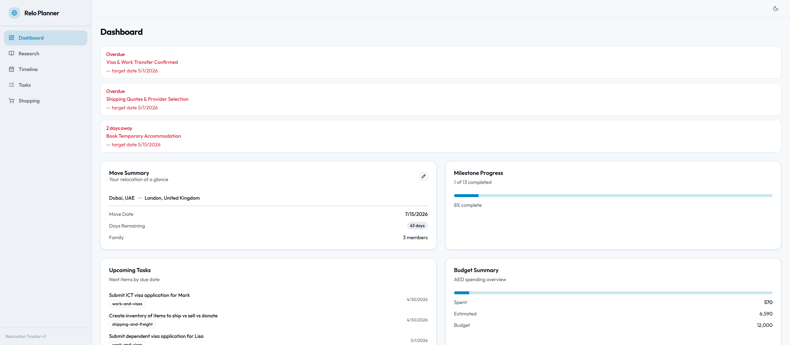

# My Relocation Planner

My Relocation Planner is a relocation planning app for managing the practical work around an international move. It combines schedule tracking, research notes, task management, and shopping budget monitoring in a single local web application backed by editable data files.



## What it does

- Gives you a dashboard view of the move with destination summary, move date, countdown, milestone alerts, upcoming tasks, and budget progress.
- Lets you maintain relocation research topics as Markdown documents with tags, status, and live preview/editing.
- Tracks milestones on a chronological timeline so you can see what is coming next and what is complete.
- Organizes tasks by category, status, priority, and due date, with create, edit, and delete actions.
- Tracks shopping and move-related purchases with quantities, estimated and actual costs, category budgets, and currency conversion.
- Stores app state in local files under `data/`, making it easy to inspect, back up, or edit outside the UI.

## How it works

The frontend is a Vite + React + TypeScript SPA. It talks to a local Express API that reads and writes the files in `data/`:

- `data/config.json` for move configuration
- `data/tasks.yaml` for tasks
- `data/milestones.yaml` for milestones
- `data/shopping.yaml` for shopping items and budgets
- `data/research/*.md` for research topics with frontmatter and Markdown content

TanStack Query is used on the client for data fetching, caching, and invalidation after updates.

## Run locally

### Prerequisites

- Node.js
- npm

### Install

```bash
npm install
```

### Start the app

```bash
npm run dev
```

This starts:

- The Vite client on `http://localhost:5173`
- The Express API on `http://localhost:3001`

The client proxies `/api` requests to the API during development.

### Other useful commands

```bash
npm run dev:client
npm run dev:server
npm run build
npm run test
```

## Main areas

### Dashboard

The homepage surfaces the most time-sensitive information first: overdue milestones, a move countdown, milestone completion progress, the next tasks due, and current spend versus budget.

### Research

Research topics are stored as Markdown files and can be created, tagged, updated, and edited directly in the app with a write/preview workflow.

### Timeline

Milestones are displayed in date order with category, status, notes, and inline editing.

### Tasks

Tasks can be grouped by category and managed by due date, status, and priority.

### Shopping

Shopping combines a budget overview with an item table so you can track planned versus actual spend across relocation categories.

## Project structure

```text
src/      Frontend application
server/   Express API routes and file-backed data access
data/     Runtime data files used by the app
docs/     Documentation assets, including screenshots
```